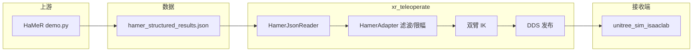

# HaMeR 手部位姿回放 → Isaac Lab 仿真（使用说明）

本文档描述 **Real2Sim** 链路中 **遥操作侧（本仓库 `xr_teleoperate`）** 的扩展能力：从 **HaMeR** 导出的结构化 JSON 读取左右腕在机器人基座系下的位姿，经双臂 IK 与 Unitree SDK，在 **`--sim` 模式**下通过 **Cyclone DDS** 把关节目标发给 **接收端 [unitree_sim_isaaclab](https://github.com/unitreerobotics/unitree_sim_isaaclab)**（Isaac Lab 中的 Unitree 仿真）。

> **与主文档的关系**：通用安装、证书、真机 XR 遥操作、仿真截图等仍以仓库根目录 [README.md](README.md)、[README_zh-CN.md](README_zh-CN.md) 为准。本文只覆盖 **HaMeR JSON 回放 + Isaac Lab** 的数据约定、启动顺序与排错。

---

## 1. 功能概览

| 项目 | 说明 |
|------|------|
| **输入** | HaMeR `demo.py` 生成的 `hamer_structured_results.json`（或等价文件名） |
| **输出** | 与 XR 仿真模式相同：双臂控制指令经 DDS 发往仿真（域 ID **1**） |
| **当前范围** | **仅双臂**跟随 JSON 中的腕部位姿（`p_wrist_base` / `R_wrist_base`）；**灵巧手目标不随 JSON 更新**（`hand_pose` 等字段被读取但不用于遥操作） |
| **入口脚本** | `teleop/teleop_hamer_and_arm.py`（内部自动追加 `--input-source hamer`） |
| **等价调用** | `python teleop_hand_and_arm.py --input-source hamer --hamer-json ...`（其余参数相同） |



---

## 2. 端到端前置条件

### 2.1 本仓库（xr_teleoperate）

- 按 [README_zh-CN.md](README_zh-CN.md) 完成 **conda 环境、子模块、`teleimager` / `televuer` 安装** 等。
- **HaMeR 模式仍会通过 `ImageClient` 调用 `get_cam_config()`**，因此需要 **teleimager 与 `cam_config_server.yaml` 所描述的服务可用**（与仿真章节一致）。不戴 XR 头显时，本地图像拉取需求已关闭（`xr_need_local_img = False`），但 **配置拉取依赖服务进程**。

### 2.2 接收端（Isaac Lab）

- 安装并运行 **[unitree_sim_isaaclab](https://github.com/unitreerobotics/unitree_sim_isaaclab)**（以该仓库 README 为准）。
- 任务、机器人型号（如 G1 29DoF + Dex3）必须与下文 **`--arm` / `--ee`** 及仿真启动参数一致。
- 仿真启动后需在窗口内 **点击一次** 激活主循环（终端出现类似 `controller started, start main loop...`）。

### 2.3 上游 HaMeR（生成 JSON）

Real2Sim 仓库内可参考同级目录 **[`../hamer/Use.md`](../hamer/Use.md)**（环境、`demo.py` 用法）。生成与本遥操作兼容的 JSON 时，必须满足下一节字段约定。

---

## 3. JSON 文件约定

### 3.1 路径与命名

- 默认文件名：**`hamer_structured_results.json`**（对应 HaMeR `demo.py` 的 `--structured_file`）。
- 遥操作可通过 **`--hamer-json <绝对或相对路径>`** 指定文件，或通过 **`--hamer-out-dir`** + **`--hamer-structured-file`** 拼出路径（与 `demo.py` 的 `out_folder` 一致）。

### 3.2 顶层结构

支持两种形式：

- 对象：`{"frames": [ ... ]}`
- 数组：`[ ... ]`（每条记录一行手）

同一 **`frame_idx`** 下的 `left` / `right` 会在读取阶段合并为**一帧**。

### 3.3 每条记录必需 / 可选字段

| 字段 | 必需 | 说明 |
|------|------|------|
| `frame_idx`（或部分兼容键 `frame` / `idx`） | 是 | 整数帧序号，决定播放顺序 |
| `hand_side` | 是 | `left` / `right`（或 `l` / `r`） |
| `p_wrist_base` | 是 | 腕部位置，基座系，长度 3 |
| `R_wrist_base` | 是 | 腕部旋转，3×3 或展平为长度 9 |
| `score` | 否 | 低于 `--hamer-score-thresh`（默认 `0.5`）的记录会被丢弃 |
| `timestamp_sec`（或 `t`） | 否 | 浮点，当前主要用于占位 |
| `hand_pose` / `global_orient` | 否 | 会被读入但 **不用于当前遥操作手指控制** |

### 3.4 关键：基座系位姿（两种方式任选其一）

1. **在 HaMeR 里导出**：`demo.py` 传入 **`--cam2base_json`**（内含 4×4 **`T_cam2base`**，相机→机器人基座）时，会写入 **`p_wrist_base` / `R_wrist_base`**。
2. **仅在遥操作侧变换**：若 JSON 里只有 **`p_wrist` / `R_wrist`**（未跑过 cam2base），可在启动 xr_teleoperate 时增加 **`--hamer-cam2base-json <path>`**，使用**与 HaMeR 相同格式**的外参文件，在加载 JSON 时按与 `demo.py` 相同的公式变换到基座系（无需重新跑 HaMeR）。

若两者都没有，则无法得到 IK 所需的基座系腕部位姿。

### 3.5 示例（单条记录）

```json
{
  "frame_idx": 0,
  "hand_side": "right",
  "score": 0.92,
  "p_wrist_base": [0.35, -0.12, 1.05],
  "R_wrist_base": [[1, 0, 0], [0, 1, 0], [0, 0, 1]]
}
```

---

## 4. 启动顺序与命令

### 4.1 顺序

1. **先**启动 **unitree_sim_isaaclab**，并点击窗口激活。
2. **再**在 `xr_teleoperate/teleop` 下启动 **HaMeR 回放 + `--sim`**。
3. 终端按 **`r`** 开始跟踪，**`q`** 退出（与 XR 模式一致）。若使用 **`--ipc`**，可通过 ZMQ 发送 `CMD_START` / `CMD_STOP`（见 `teleop/utils/ipc.py`）。

### 4.2 接收端示例（与官方中文 README 一致，按你机器修改 task / device）

```bash
conda activate unitree_sim_env
cd ~/unitree_sim_isaaclab
python sim_main.py --device cpu --enable_cameras \
  --task Isaac-PickPlace-Cylinder-G129-Dex3-Joint \
  --enable_dex3_dds --robot_type g129
```

### 4.3 发送端方式 A：直接指定 JSON

```bash
conda activate tv
cd /path/to/xr_teleoperate/teleop

python teleop_hamer_and_arm.py \
  --arm G1_29 --ee dex3 --sim \
  --hamer-json /path/to/hamer_out/hamer_structured_results.json \
  --replay-fps 30
```

### 4.4 发送端方式 B：只给 HaMeR 的 `out_folder`

```bash
python teleop_hamer_and_arm.py \
  --arm G1_29 --ee dex3 --sim \
  --hamer-out-dir /path/to/hamer_out \
  --hamer-structured-file hamer_structured_results.json \
  --replay-fps 30
```

### 4.5 等价：显式指定输入源

```bash
python teleop_hand_and_arm.py --input-source hamer \
  --hamer-json /path/to/hamer_structured_results.json \
  --arm G1_29 --ee dex3 --sim --replay-fps 30
```

**参数别名**：命令行同时支持连字符与下划线，例如 `--hamer-json` 与 `--hamer_json`、`--replay-fps` 与 `--replay_fps`。

### 4.6 帧率

- 使用 **`--replay-fps`** 会覆盖主循环用的 **`--frequency`**，建议与 HaMeR 推理时的 **`--assume_fps`** 一致（例如均为 30），避免时间观感与仿真步长错位。

---

## 5. 常用参数一览

| 参数 | 作用 |
|------|------|
| `--sim` | 仿真模式：`ChannelFactoryInitialize(1, ...)`，需与 Isaac Lab 侧 DDS 域一致 |
| `--arm` | `G1_29` / `G1_23` / `H1_2` / `H1`，须与仿真机器人一致 |
| `--ee` | `dex3` / `dex1` / `inspire_*` / `brainco` 等，须与仿真末端一致 |
| `--network-interface` | Cyclone DDS 网卡名；多网卡时建议显式指定。**Linux** 常见 `eth0`；**Windows** 请使用系统实际网卡名称（如「以太网」），并保证与仿真机网络互通 |
| `--hamer-json` / `--hamer-out-dir` | JSON 路径或 HaMeR 输出目录（二选一，见上文） |
| `--hamer-structured-file` | 与 `out_dir` 联用时的文件名，默认 `hamer_structured_results.json` |
| `--replay-fps` | 主循环频率 |
| `--hamer-loop` | JSON 播放结束后从头循环 |
| `--hamer-score-thresh` | 检测分数阈值，默认 `0.5` |
| `--hamer-frame-offset-json` | 可选：帧索引对齐。文件可为 `{"global_offset": N, "10": 1, ...}`（除 `global_offset` 外键为帧号、值为偏移） |
| `--hamer-cam2base-json` | 当 JSON 仅有 `p_wrist`/`R_wrist` 时必填（或与 HaMeR 侧 `--cam2base_json` 指向同一文件）；内容为含 `T_cam2base` 的 4×4 外参 |
| `--hamer-arm-only` | 显式「仅手臂」；HaMeR 模式下手部本已不跟随，此参数语义上与之一致 |
| `--record` | 录制 episode；仿真下可配合 sim state 相关逻辑 |
| `--ipc` | 进程间命令替代键盘 |

**注意**：HaMeR 不提供手柄或位移；若使用 **`--motion`** 且 **`--input-mode controller`**，会收到警告且位移控制基本无效。

---

## 6. 标定与滤波（进阶）

- **腕部 → 末端外参**：默认 `WristToEEConfig.identity()`（`teleop/input_source/hamer_to_robot_frame.py`）。若仿真中与视觉系不一致，可在 `teleop_hand_and_arm.py` 初始化 `HamerAdapter` 处改为自定义 `WristToEEConfig(t_left, R_left, t_right, R_right)`。
- **抖动与突变**：`HamerAdapter` 内指数平滑与 `max_step_m` / `max_step_rad` 限幅；可调 `teleop/input_source/hamer_adapter.py`、`hamer_filters.py`。

---

## 7. 故障排查

| 现象 | 可能原因 |
|------|----------|
| 启动报找不到 JSON | 检查 `--hamer-json` 或 `--hamer-out-dir` + `--hamer-structured-file` |
| 加载帧数为 0 或手臂不动 | JSON 缺少 `p_wrist_base`/`R_wrist_base`；确认 HaMeR 使用了 `--cam2base_json` |
| 本程序无法连接图像/配置服务 | HaMeR 模式仍需要 `get_cam_config()`；确认 teleimager 与配置可访问 |
| 仿真无响应 | 仿真未先启动或未点窗口；未加 `--sim`；DDS **域 ID** 或 **网卡** 与 Isaac 侧不一致 |
| 左右手反了 | 检查 `hand_side` 与相机镜像；必要时用帧偏移或外参修正 |

---

## 8. 相关源码路径

| 路径 | 作用 |
|------|------|
| `teleop/teleop_hamer_and_arm.py` | HaMeR 专用入口，注入 `--input-source hamer` |
| `teleop/teleop_hand_and_arm.py` | 主循环、所有 `--hamer-*` 参数定义、IK 与 DDS 控制 |
| `teleop/input_source/hamer_input.py` | 读 JSON、按帧合并左右手 |
| `teleop/input_source/hamer_adapter.py` | 滤波、步进限幅、腕→末端目标 |
| `teleop/input_source/hamer_to_robot_frame.py` | `WristToEEConfig` 与坐标变换 |
| `teleop/input_source/hamer_filters.py` | 平滑与限幅工具 |

HaMeR 输出校验可参考 Real2Sim 内 **`hamer/validate_hamer_output.py`**（若存在）。

---

## 9. 版本与上游

- 本功能在 **xr_teleoperate** 上与官方 XR 仿真路径共用 `ArmController(..., simulation_mode=True)` 与 DDS 约定；Isaac 侧行为以 **unitree_sim_isaaclab** 仓库文档为准。
